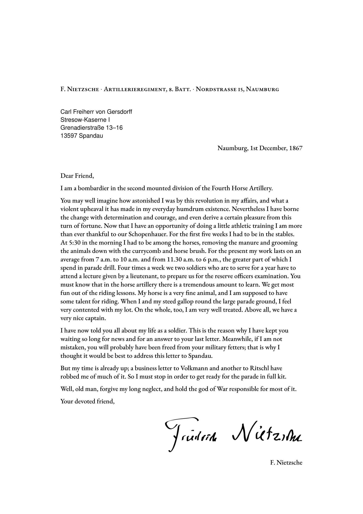

# letter-typst

A port of [mrzool/tex-boilerplate](https://github.com/mrzool/letter-boilerplate) in Typst using native scripting features.



## Dependencies
- EB Garamond, available on [Google Fonts](https://fonts.google.com/specimen/EB+Garamond)
  - Other good open-source options: [Cardo](https://fonts.google.com/specimen/Cardo), [Libre Baskerville](https://fonts.google.com/specimen/Libre+Baskerville), [Crimson](https://fonts.google.com/specimen/Crimson+Text), [Libre Caslon Text](https://fonts.google.com/specimen/Libre+Caslon+Text)
- Nimbus Sans L, available on [Font Library](https://fontlibrary.org/en/font/nimbus-sans-l)

## Other resources

If you intend to typeset from your editor, consider:
1. [Typst](https://github.com/typst/typst#installation) CLI
2. [Tinymist](https://myriad-dreamin.github.io/tinymist/frontend/main.html) language server for editor integration
3. [`typstyle`](https://enter-tainer.github.io/typstyle/) formatter
4. [`typst-ts-mode`](https://codeberg.org/meow_king/typst-ts-mode) for an Emacs-compatible `treesit` grammar

## Instructions

1. Clone this repository:

```
git clone https://codeberg.org/melindachang/letter-typst.git
cd letter-typst
```

2. Edit the information in `raw.typ`.

3. Use the Typst CLI to compile to PDF.
```
typst compile letter.typ
```

